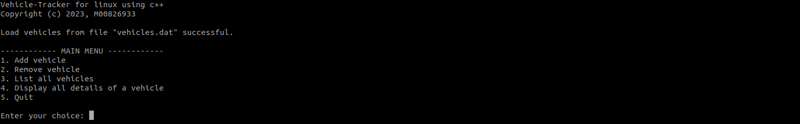

# Vehicle Tracking System

This project is a simple vehicle tracking system implemented in `C++` that allows users to add, remove, list, and display details of different types of vehicles. The program reads vehicle details from a file and provides a user-friendly interface for interacting with the data.



## Getting Started

### Prerequisites

- C++ compiler (g++)
- CMake (for building Catch2 tests)
- Catch2 (testing)

### Compilation

1. Clone the repository to your local machine:

   ```bash
   git clone https://github.com/derecklhw/vehicle_tracking_system.git
   ```

2. Compile the executable and test program using the provided Makefile:

   ```bash
   make all & make test
   ```

   This will create two executables: `vehicle_tracking` for the main program and `testing` for running tests.

## Usage

Run the main program:

```bash
./execute <filename>
```

Replace `<filename>` with the name of the file containing vehicle details. The program will load the vehicle details from the file and present a main menu for different operations.

## Testing

The project includes tests using `Catch2`. To run the tests, use the following command:

```bash
./testing
```
